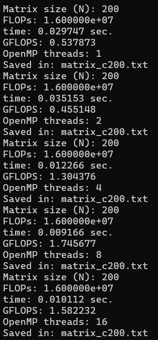
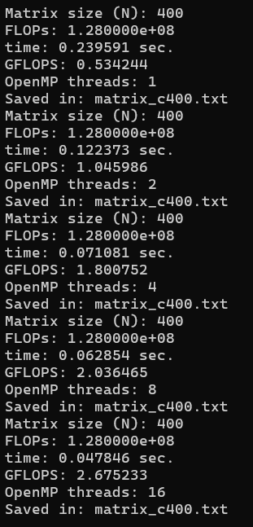
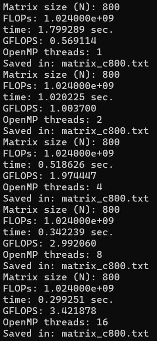
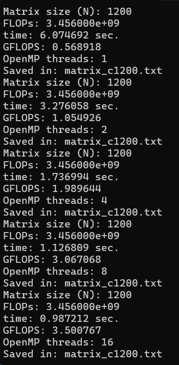
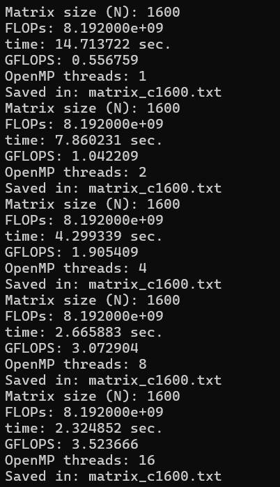
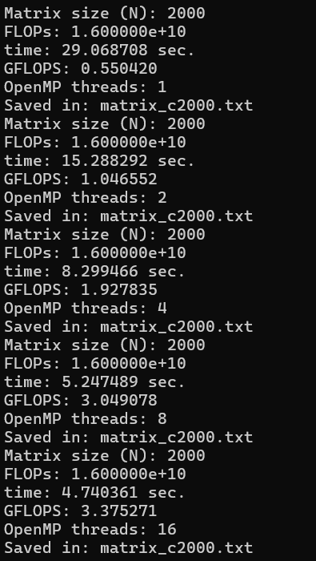
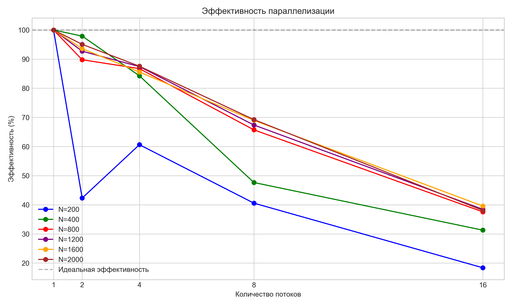
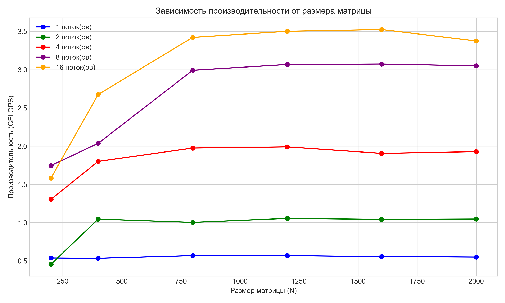
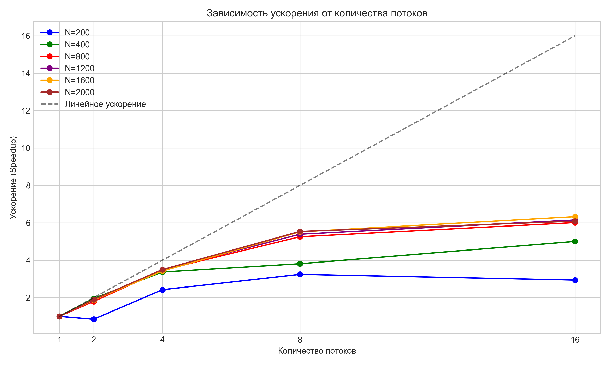
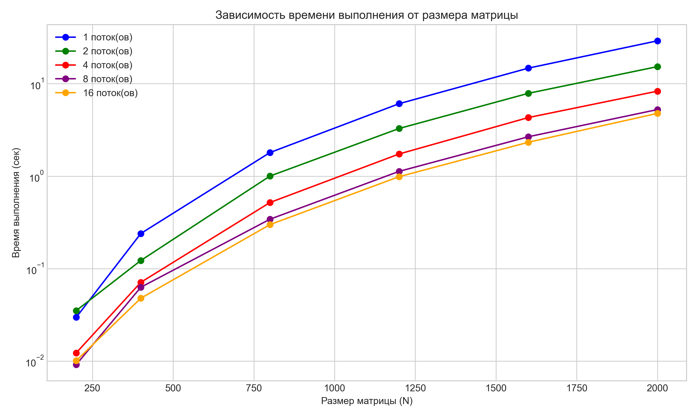

# Lab2
## Описание
Программа для перемножения двух квадратных матриц с использованием технологии распараллеливания **OpenMP**. 
Выполняет замеры времени, вычисляет производительность (GFLOPS) и автоматически верифицирует результаты.
## Результаты исследований
### Для матриц 200*200

### Для матриц 400*400

### Для матриц 800*800

### Для матриц 1200*1200

### Для матриц 1600*1600

### Для матриц 2000*2000

## Обработка результатов исследований
### Эффективность параллелизации

### Зависимость производительности от размера матрицы

### Зависимость ускорения от кол-ва потоков

### Зависимость времени выполнения от размера матрицы

