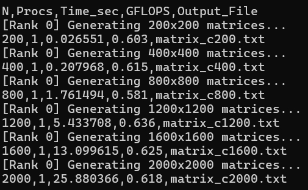
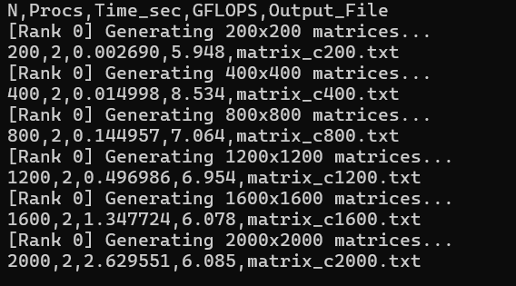
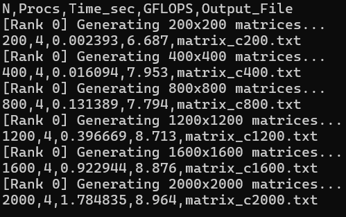
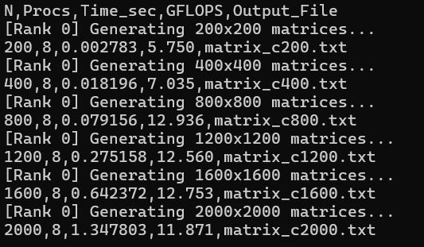
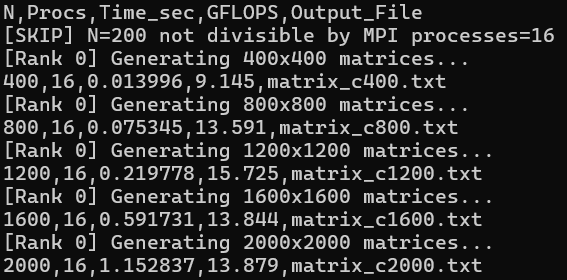
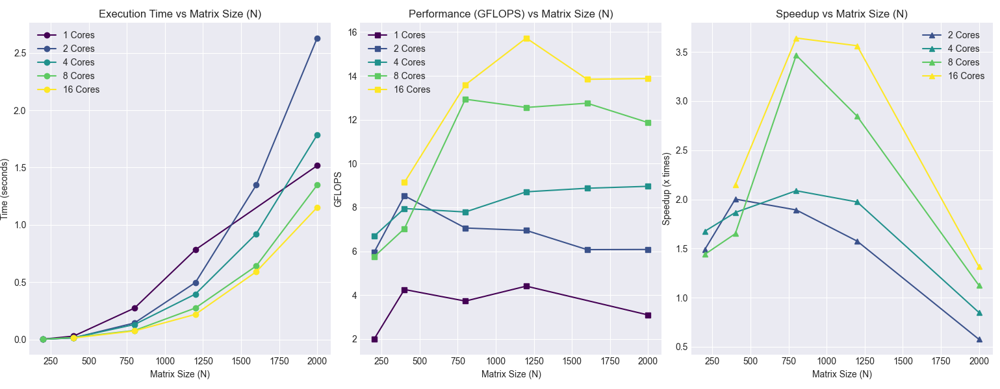

# Lab4

## Выводы по лабораторной работе №4

### 1. Параллельная модель вычислений CUDA

Код использует иерархию Grid → Block → Thread, где каждый поток вычисляет один элемент результирующей матрицы C[i][j]. Перебор конфигураций блоков (8×8, 16×16, 32×32) позволяет найти баланс между загрузкой ядер GPU и потреблением ресурсов (регистры, разделяемая память), что напрямую влияет на итоговую производительность.

### 2. Управление памятью и передача данных

Матрицы создаются в оперативной памяти (хост), затем копируются в видеопамять (устройство) через cudaMemcpy. Вычисления выполняются исключительно на GPU, после чего результат копируется обратно для сохранения в файл. Критически важно, что замеры времени (cudaEvent) фиксируют только работу ядра, исключая накладные расходы на передачу данных.

### 3. Бенчмаркинг и метрики производительности

Для каждого размера матрицы и конфигурации блока измеряется время выполнения, на основе которого рассчитывается производительность в GFLOPS (2·N³ / time). Это позволяет объективно сравнивать эффективность разных настроек и выявлять «узкие места» — в данном случае ограничение пропускной способностью памяти, а не вычислительной мощностью.

### Основной вывод по результатам лабораторной

Конфигурация блока 16×16 демонстрирует наилучшую производительность на всех размерах матриц, достигая ~50 GFLOPS при N=2000 на GTX 1650 Super. Это составляет около 36% от теоретического пика FP64 для данной карты, что характерно для наивного алгоритма умножения матриц, ограниченного пропускной способностью глобальной памяти. Для дальнейшего ускорения рекомендуется использовать оптимизации: тайлинг с разделяемой памятью (__shared__), переход на float (если допустима точность) или интеграцию библиотеки cuBLAS, способной раскрыть потенциал тензорных ядер и достичь 800–1100 GFLOPS.

## Результаты лабораторной работы

### Результаты 

=================================================================================================

## Выводы по лабораторной работе №1

### Рост производительности с увеличением размера
- **N=400**: `0.97 GFLOPS`
- **N=2000**: `2.23 GFLOPS`
- **Производительность выросла в 2.3 раза**

### Эффект масштаба
- Малые матрицы (`N=400–800`) имеют низкую эффективность из-за накладных расходов на параллелизацию.
- При **N ≥ 1200** производительность стабилизируется и растёт медленнее.

### Характер масштабирования
- Время растёт примерно как **O(N³)**, что соответствует теоретической сложности алгоритма.
- **GFLOPS** выходит на «плато» ~`2.2 GFLOPS` при больших `N`.
=========================================================================
# Lab2
## Описание
Программа для перемножения двух квадратных матриц с использованием технологии распараллеливания **OpenMP**. 
Выполняет замеры времени, вычисляет производительность (GFLOPS) и автоматически верифицирует результаты.
## Результаты исследований
### Для матриц 200*200

### Для матриц 400*400

### Для матриц 800*800

### Для матриц 1200*1200

### Для матриц 1600*1600

### Для матриц 2000*2000

## Обработка результатов исследований
### Эффективность параллелизации

### Зависимость производительности от размера матрицы

### Зависимость ускорения от кол-ва потоков

### Зависимость времени выполнения от размера матрицы

=========================================================================
# Lab 3
## Описание
Эта программа умножает две большие матрицы, распределяя вычисления между несколькими ядрами процессора с помощью технологии MPI. Она автоматически тестирует разные размеры матриц и измеряет, насколько быстрее работает программа при увеличении количества вычислительных ядер.
## Результаты исследований
### Для 1

### Для 2

### Для 4

### Для 8

### Для 16

## Обработка результатов

